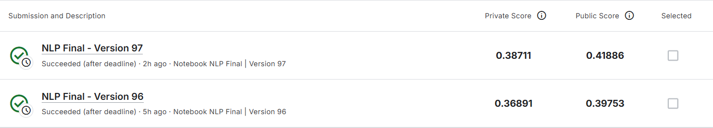

# NLP 2025 Fall Final Project: Google QUEST Q&A Labeling

**Topic:** Understanding of Complex Q&A Content  
**Competition:** [Google QUEST Q&A Labeling](https://www.kaggle.com/competitions/google-quest-challenge/overview)


## Team T15 (National Taiwan University)

| ID | Name | Department |
|---|---|---|
| b10102079 | 王柔蘋 | 外文五 |
| b133030383 | 陳彥丞 | 經濟二 |
| b12901109 | 陳政年 | 電機三 |


## 📄 Documentation

- **Original Submission Report:** [./doc/Report_Submission.pdf](./doc/Report_Submission.pdf)
- **Extended Report (Improved):** [./doc/Report.pdf](./doc/Report.pdf) or [./doc/Report.md](./doc/Report.md)


## 📋 Table of Contents

- [Project Overview](#project-overview)
- [Models Used](#models-used)
- [Key Features](#key-features)
- [How to Reproduce](#how-to-reproduce)
- [Results](#results)
- [Utilities & Tools](#utilities--tools)
- [Troubleshooting](#troubleshooting)


## Project Overview

This project tackles the **Google QUEST Q&A Labeling** challenge, which requires multi-label classification of question-answer pairs across **30 different quality attributes**. The task involves understanding complex Q&A content and predicting relevance, clarity, answerability, and other linguistic properties.

**Key Challenges:**
- Multi-label regression/classification task (30 continuous targets)
- Need to understand both question and answer semantics
- Limited training data (~6K samples)
- Balanced evaluation across diverse quality dimensions

**Our Approach:**
- Ensemble of 6 transformer-based models (DeBERTa, Electra, XLNet, Qwen, LLaMA, ModernBERT)
- 5-fold cross-validation for robust training
- 6-Head grouped output architecture for capturing target correlations
- Advanced post-processing strategies (Voters, Distribution, OptimizedRounder)
- Hyperparameter optimization via Tree-structured Parzen Estimator (TPE)

---

## Models Used

| Model | Type | Pretrained | Hidden Size |
|-------|------|-----------|-------------|
| **DeBERTa v3** | Encoder | microsoft/deberta-v3-base | 768 |
| **Electra** | Encoder | google/electra-base-discriminator | 256 |
| **XLNet** | Autoregressive | xlnet-base-cased | 768 |
| **Qwen 3** | LLM | Qwen/Qwen3-0.6B | 1024 |
| **LLaMA 3.2** | LLM | meta-llama/Llama-3.2-1B | 2048 |
| **ModernBERT** | Encoder | answerdotai/ModernBERT-base | 768 |

All models use a **6-Head grouped architecture** to capture correlations between target quality attributes.

## Key Features

- **6-model Ensemble:** Combines multiple transformer architectures (DeBERTa, Electra, XLNet, Qwen, LLaMA, ModernBERT)
- **5-Fold Cross-Validation:** Robust training strategy with model averaging
- **6-Head Grouped Architecture:** Captures correlations between target quality attributes
- **Advanced Post-Processing:** Multiple strategies for predictions refinement

**For detailed information and experiments, please refer to [Extended Report](./doc/Report.md)**

## How to Reproduce

### Step 1: Environment Setup

Install dependencies:

```bash
conda install -c conda-forge gcc_linux-64 gxx_linux-64 -y
pip install -r requirements.txt
```

Requires Python ≥ 3.8, PyTorch with CUDA, and Transformers ≥ 4.20. GPU with ≥12GB VRAM recommended.
If you encounter compatibility issues with ModernBERT on newer Python versions, consider using Python 3.10 or earlier.

### Step 2: Prepare Dataset

Download dataset from [Kaggle competition](https://www.kaggle.com/competitions/google-quest-challenge/data) and place in `./data/` directory:
- `train.csv` - Training data
- `test.csv` - Test data
- `sample_submission.csv` - Submission template

---

### Step 3: Train Models (or Download Pretrained Weights)

#### **Option A: Train from Scratch**

Train all models using the batch script:

```bash
bash train_all.sh
```

Or train individual models directly:
```bash
python ./src/single_regression_deberta/train.py
python ./src/electra/train.py
python ./src/xlnet/train.py
python ./src/qwen/train.py
python ./src/llama/train.py
python ./src/modernbert/train.py
```

#### **Option B: Download Pretrained Weights**

Download pretrained weights from [HuggingFace](https://huggingface.co/Akiraw/NLP_Final) and place in `./model/` directory.

---

### Step 4: Optimize Ensemble Weights

#### **Option A: Optimize from Scratch**

Optimize blend weights using hyperparameter optimization:

```bash
python ./src/TPE.py
```

Generates multiple `<???>_weights_<???>.json` with optimal weights for each model and fold.
The `hierarchical_weights.json` is the final output that contains full weights

#### **Option B: Using Our Optimized Weights**

The `hierarchical_weights.json` at the root directory is our weight

---

### Step 5: Prepare Kaggle Submission

For some of the models that there are no official model in kaggle, you have to upload yourself
Prepare models for Kaggle:

```bash
# Download and prepare model files for Kaggle upload
python ./src/single_regression_deberta/download.py
python ./src/electra/download.py
python ./src/xlnet/download.py
```

---

### Step 6: Kaggle Submission

1. Upload `./src/kaggle_all.ipynb` to Kaggle, and delete some of the ModelSpec if you don't want them (deberta, modernbert, xlnet only in our result)
2. Attach official model data and trained weights and TPE weight to notebook
3. Configure internet, and gpu options in notebook configurations
4. Configure paths in notebook code cell
5. Press submit in the sidebar

## Results

*Note: In the images below, the left side shows the private score and the right side shows the public score.*

### Final Performance Before Submission (Multiple Models Average without TPE)


### Best Performance Before Submission (DeBERTa Only)


*Note: In the images below, the below one is without voter post-processing, the above one is with voter post-processing*

### Best and Final Performance After Submission


## Utilities & Tools

### Analyze Target Grouping Strategy

Visualize and understand the 6-group target structure:

```bash
python ./util/analyze_target.py
```

**Output:**
- Text output with group assignments in terminal
- Images for correlation heatmap saved to root directory