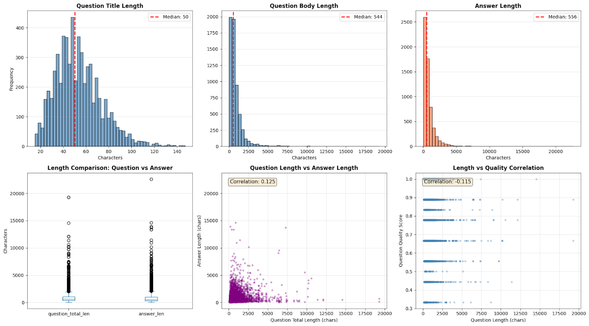
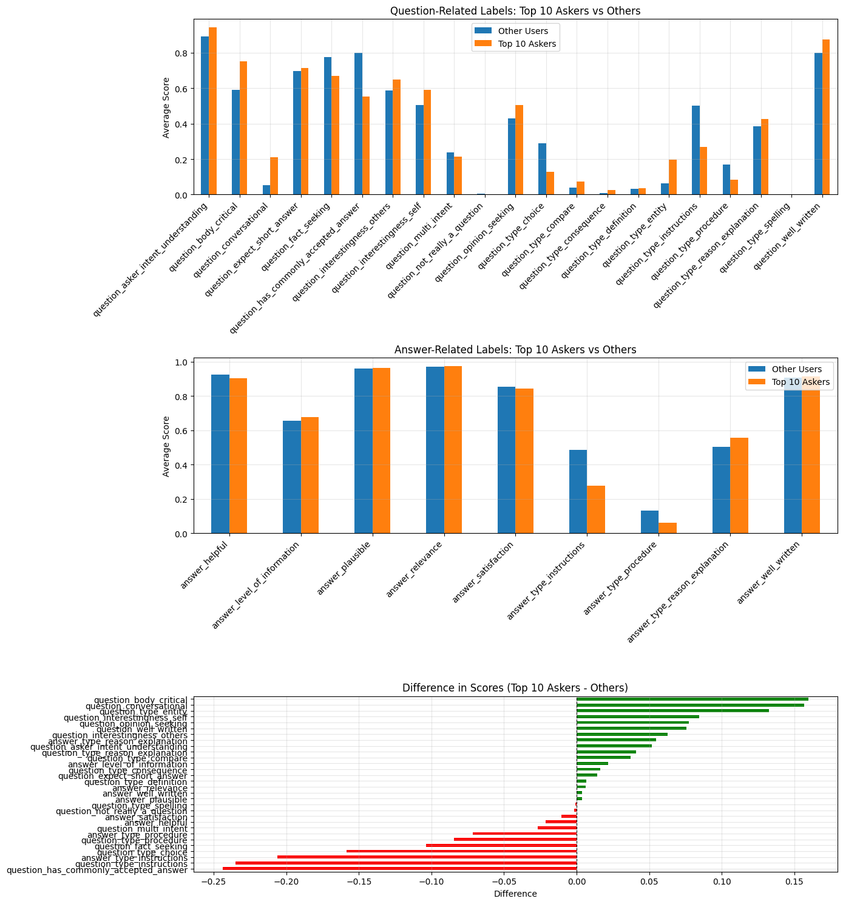
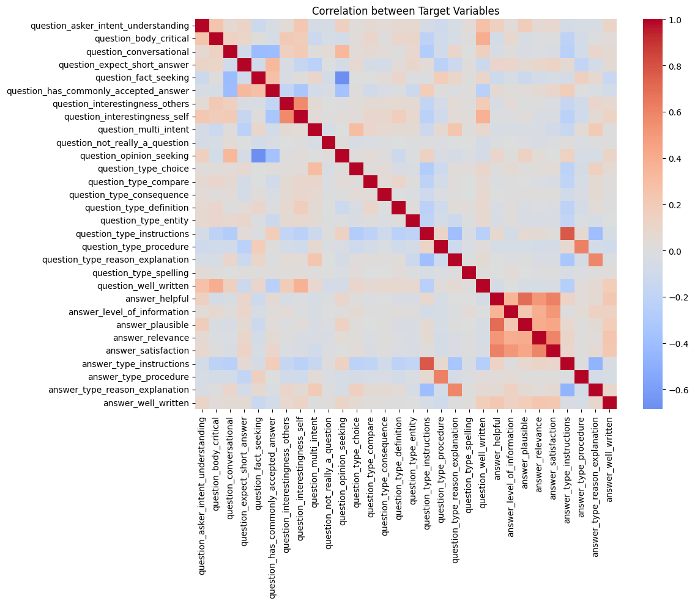

# **NLP 2025 Fall Final Project Report**

# **About**
### **Topic:** Google Quest QA Labeling
### **Team:** T15
### **University:** NTU 國立臺灣大學 
### **Members:** 
- ### b10102079 外文五 王柔蘋
- ### B133030383 經濟二 陳彥丞
- ### b12901109 電機三 陳政年

# **Task Description**

## **A. Task**
We are challenged to use the given dataset to build predictive model for different subjective aspects of question-answering.

## **B. Dataset**
- **Data collection:**
    - The question-answer pairs were gathered from nearly 70 different websites, in a "common-sense" fashion.
- **Data shape:**
    - Dataset given: train ( 6079, 41 ), test ( 476, 11 ), sample_submission ( 476, 31 )
    - 41 columns: 10 input feature columns + 30 target labels to predict + 1 qa_id
- **Feature columns:**
    - ['question_title', 'question_body', 'question_user_name', 'question_user_page', 'answer', 'answer_user_name', 'answer_user_page', 'url', 'category', 'host'] 
    - Metadata that shows question user property, answer user property and category of question.
- **Target_columns:**
    - ['qa_id', 'question_asker_intent_understanding', 'question_body_critical', …]
    - 21 question-related labels, 9 answer-related labels, identified by ‘qa_id’
    - Labels that assess various qualities of the questions and answers.
    - No missing value.

<div style="page-break-after: always;"></div>

# **Data Exploration**

## **A. Question Title, Body, and Answer Body Length**

<div align="center">
  
</div>

* **Question Titles:** 
    - Right-skewed with median=50 chars; most concentrated between 40-70 chars.
* **Question Bodies:** 
    - Heavily right-skewed with median=544 chars; extreme outliers up to 20K chars.
* **Answers:** 
    - Similar pattern to question bodies; median=556 chars with a long tail.
* **Correlations:**
    * Weak positive correlation (0.125) between question and answer length (longer questions don't necessarily get longer answers).
    * Negative correlation (-0.115) between question length and quality score (longer questions are rated slightly lower).

<div style="page-break-after: always;"></div>

## **B. QA Quality vs. User Frequency**

<div align="center">
  
</div>


**Top 10 Askers Quality Differences:**
* **Lower Quality in:**
    * *Conversational tone:* -0.20 difference (write less conversationally).
    * *Multi-intent:* -0.15 difference (ask more focused questions).
    * *Opinion-seeking:* -0.10 difference (ask fewer opinion questions).
    * *Body critical:* Score lower (~0.20 difference).
* **Higher Quality in:**
    * *Well-written:* +0.15 difference (better writing quality).
    * *Type (Reason/Explanation):* +0.10 difference (more explanation-seeking).
    * *Type (Spelling):* Slightly higher.

> **Insight:** User frequency has minimal impact on answer quality. Answer quality is likely more dependent on question characteristics than on who asks, implying user features may not be strong predictors.

<div style="page-break-after: always;"></div>

## **C. Target Variable Correlation Matrix**

<div align="center">
  
</div>

**1. Strong Positive Correlations (Within-Group Clustering)**
* **Answer Quality Cluster:** High intercorrelation (~0.8-0.9) between `answer_helpful`, `answer_relevance`, `answer_satisfaction`, and `answer_well_written`.
* **Question Quality Cluster:** Moderate correlation (~0.5) between `question_well_written` and `question_asker_intent_understanding`; ~0.7 between `question_interestingness_others` and `question_interestingness_self`.

**2. Question-Answer Type Alignment**
* Strong alignment between Question and Answer types (e.g., Instructions ↔ Instructions, Procedure ↔ Procedure).
* *Insight:* Question type strongly predicts answer type.

**3. Negative Correlations (Mutually Exclusive)**
* `question_expect_short_answer` ↔ `question_type_reason_explanation` (~-0.4).
* `question_fact_seeking` ↔ `question_opinion_seeking` (~-0.3).
* `question_conversational` negatively correlates with multiple formal question types.

**4. Low Cross-Correlations**
* **Question Metrics ↔ Answer Metrics:** Mostly weak (~0.0-0.3).
* *Implication:* Models must learn Q-A interactions rather than relying on direct linear correlations.

<div style="page-break-after: always;"></div>

## **D. Key Data Challenges**
**1. Dataset Scale & Quality**
* **Limited Data:** Only 6,079 samples increases overfitting risk and necessitates transfer learning (e.g., DeBERTa) with careful regularization.
* **Imbalanced Targets:** Labels are skewed toward discrete ranges rather than continuous distributions, requiring post-processing (e.g., OptimizedRounder).

**2. Text Characteristics**
* **High Length Variability:** Q&A lengths range widely (CV > 1.16). ~7% exceed typical token limits, requiring truncation strategies and masked pooling.
* **Uneven Token Allocation:** Varying Q-A proportions motivate separate pooling mechanisms (`Q_Avg` and `A_Avg`).
* **Domain-Specific Language:** Code snippets and technical jargon require domain-adapted tokenization.

**3. Target Variable Structure**
* **Independence:** Low cross-correlations imply single unified representations are insufficient; separate encoding pathways needed.
* **Clustering:** Strong intercorrelations in answer quality suggest latent constructs suitable for multi-task learning.
* **Multi-target Complexity:** 30 distinct regression targets create a complex optimization landscape.

**4. Data Structure Issues**
* **Data Leakage Risk:** Multiple answers per question require `GroupKFold` stratification by `question_body`.
* **User Frequency:** Minimal correlation with content quality suggests user features have limited predictive power.

## **E. Counter-Intuitive Findings**
* **Negative Length-Quality Correlation (r = -0.115):** Longer questions often receive lower quality ratings (likely due to verbosity/lack of focus). Attention mechanisms should focus on relevant content rather than raw length.

<div style="page-break-after: always;"></div>

# **Related works**

## **A. Rank 1st Solution**
**1. Domain Adaptation & Transfer Learning**
* **StackExchange Fine-tuning:** Fine-tuned BERT on cleaned StackExchange data to assist with domain adaptation.
* **Objectives:** Used MLM (Masked Language Model) and SOP (Sentence Order Prediction).
* **Vocabulary Extension:** Added LaTeX symbols to the vocabulary to handle mathematical expressions.

**2. Data Strategy**
* **Auxiliary Targets:** Built additional targets to guide the model.
* **Pseudo-labeling:** Used pseudo-labels to augment training data.
* **Validation:** Utilized **Group K-Fold** cross-validation to prevent data leakage (ensuring different answers to the same question don't end up in both train and val).

**3. Model Architectures & Fine-Tuning**
* **Ensemble:** Used 4 models: BERT (x2), RoBERTa, and BART.
* **Layer Weights:** Applied Softmax-normalized weights for hidden states from all BERT layers (learning how much to weight each layer).
* **Regularization:** implemented Multi-sample dropout.

**4. Post-Processing & Blending**
* **Discretization:** Instead of simple thresholding, they discretized predictions into buckets matching the training set distribution.
* **Targeted Processing:** Applied specific post-processing to 7 specific columns.
* **Blending:** Blended predictions from the four fine-tuned models.

<div style="page-break-after: always;"></div>

## **B. Rank 3rd Solution**
**1. Multiple Model Structure**
* Utilized multiple models as backbone.
* Focused on diverse utilization of pre-trained models (e.g., using different architectures like XLNet or separate heads).

**2. Optimization Strategy**
* **TPE Optimization:** Used Tree-structured Parzen Estimator (TPE) to optimize the blending weights of all model outputs.
* **OptimizedRounder:** Implemented a specific optimization method designed to maximize the Spearman correlation metric.

**3. Trivial & Technical Details**
* **Text Processing:** Specific processing used for LSTM components.
* **Target Scaling:** Applied Min-Max scaling to targets.
* **Sample Weighting:** Assigned large weights to minor positive or negative samples to handle class imbalance.
* **Activation:** Used `gelu_new` activation for BERT-based models.
* **Scheduling:** Implemented a Cosine Warmup scheduler.
* **EMA:** Used Exponential Moving Average for weight smoothing.

## **C. Other trivial solutions**

* **Class weight:** Use CrossEntropyLoss with class weight (10th placed solution)
* **Different head output strategy:** Use ordinal regression (2nd placed solution)
* **Output optimization:** Utilize Rounding trick (4th placed solution)
* **Observe feature relationship:** Find specific output feature having high correlation with input feature, like question_type_spelling (13th placed solution)

<div style="page-break-after: always;"></div>

# **Methods**


# **Experiments**

## **A. Grouping of projector heads**

In this experiment, we obverve how the number and grouping of projector heads affect the model performance.

### **Strategy explanation:**
- **One global head:** One MLP head only that output 30 features
- **Two head, QA splited:** Two MLP heads that one responsible for question related output, the other for answer related output
- **Six head, global** We calculated the correlation of output features, then group them into 6 groups that share the most correlation.
- **Six head, QA splited** We calculated the correlation of the output features, then first split them into 2 groups (one for question, one for answer), and further split the question related into 4 groups and answer related into 2 groups by the correlation.

### **Experiment result:**
|Strategy|F0E2|F1E2|F2E2|F3E2|F4E2|Public|Private|
|-|-|-|-|-|-|-|-|
|One global head||||||0.30509|0.28049|
|Two head, QA splited|Loss: 0.3770 - Raw Score: 0.3391|Loss: 0.3797 - Raw Score: 0.3287|Loss: 0.3779 - Raw Score: 0.3360|Loss: 0.3793 - Raw Score: 0.3207|Loss: 0.3788 - Raw Score: 0.3283|0.31465|0.29607|
|Six head, QA tangled|Loss: 0.3750 - Raw Score: 0.3413|Loss: 0.3775 - Raw Score: 0.3363|Loss: 0.3767 - Raw Score: 0.3392|Loss: 0.3783 - Raw Score: 0.3239|Loss: 0.3733 - Raw Score: 0.3449|0.31958|0.30399|
|Six head, QA splited|Loss: 0.3730 - Raw Score: 0.3525|Loss: 0.3776 - Raw Score: 0.3354|Loss: 0.3767 - Raw Score: 0.3333|Loss: 0.3788 - Raw Score: 0.3285|Loss: 0.3784 - Raw Score: 0.3295|0.31968|0.30270|

### **Experiment notes:**
- Above experiment is done under the setting of one Deberta and Kflod=5, the F stands for fold ane E stands for epoch
- The actual grouping is as following:
    - **Six head, QA tangled:**
        - [Group 1]: `question_multi_intent`, `question_type_choice`, `question_type_reason_explanation`, `answer_type_reason_explanation`
        - [Group 2]: `question_asker_intent_understanding`, `question_body_critical`, `question_interestingness_others`, `question_interestingness_self`, `question_well_written`
        - [Group 3]: `question_conversational`, `question_not_really_a_question`, `question_opinion_seeking`, `question_type_compare`, `question_type_consequence`, `question_type_definition`, `question_type_entity`, `question_type_spelling`
        - [Group 4]: `answer_helpful`,`answer_level_of_information`, `answer_plausible`, `answer_relevance`, `answer_satisfaction`, `answer_well_written`
        - [Group 5]: `question_fact_seeking`, `question_type_procedure`, `answer_type_procedure`,
        - [Group 6]: `question_expect_short_answer` `question_has_commonly_accepted_answer`, `question_type_instructions`, `answer_type_instructions`
    - **Six head, QA splited:**
        - [Q Group 1]:`question_expect_short_answer`, `question_fact_seeking`, `question_has_commonly_accepted_answer`, `question_type_instructions`, `question_type_procedure`
        - [Q Group 2]:`question_asker_intent_understanding`, `question_body_critical`, `question_interestingness_others`, `question_interestingness_self`, `question_well_written`
        - [Q Group 3]:`question_conversational`, `question_opinion_seeking`
        - [Q Group 4]:`question_multi_intent`,`question_not_really_a_question`, `question_type_choice`, `question_type_compare`, `question_type_consequence`,`question_type_definition`, `question_type_entity`, `question_type_reason_explanation`, `question_type_spelling`
        - [A Group 1]:`answer_type_instructions`, `answer_type_procedure`
        - [A Group 2]:`answer_helpful`, `answer_level_of_information`, `answer_plausible`, `answer_relevance`, `answer_satisfaction`, `answer_type_reason_explanation`, `answer_well_written`

### **Findings**
From the experiment result, we can see that the model is performing the best with the strategy "Six head, QA tangled". This strategy got a slight win than "Six head, QA splited:". While there is a larger gap for the left two methods.

### **Explanation**
Because each projector head got limited capability, we distangle the heads for different output feature can make each head more robust on specific output features, and therefore boost the performance. For both the 6 head strategy, the one with QA splitted at first is more evenly grouped, therefore, we choose this as our final strategy as the loading on each group would be smaller using this strategy while maintaining good enough performance.

> **Conclusion:** We use the Six head, QA tangled strategy. As it is more evely grouped with good performance.

## **B. Class weight for CE**
In this experiment, we obverve how the use of class weight affect the model performance.

### **Experiment result:**
|Strategy|F0E2|F1E2|F2E2|F3E2|F4E2|Public|Private|
|-|-|-|-|-|-|-|-|
|Without class weight|Loss: 0.3730 - Raw Score: 0.3525|Loss: 0.3776 - Raw Score: 0.3354|Loss: 0.3767 - Raw Score: 0.3333|Loss: 0.3788 - Raw Score: 0.3285|Loss: 0.3784 - Raw Score: 0.3295|0.31968|0.30270|
|With class weight|Loss: 0.3964 - Raw Score: 0.3555|Loss: 0.4015 - Raw Score: 0.3331|Loss: 0.3990 - Raw Score: 0.3412|Epoch 2 - Loss: 0.4013 - Raw Score: 0.3379|Epoch 2 - Loss: 0.3999 - Raw Score: 0.3431|0.32706|0.31128|

The class weight strategy effectively handles label imbalance by penalizing minority classes, leading to better generalization on the test set.

### **Experiment notes:**
- Above experiment is done under the setting of one Deberta and Kflod=5, the F stands for fold ane E stands for epoch
- We adapt the weight as 10 placed solution suggested:
```
loss_fct = nn.BCEWithLogitsLoss(pos_weight=torch.Tensor([
0.9, 1, 1.5, 0.8, 0.8, 0.8, 0.96, 1.1, 1.1, 3,  1, 1.1, 2, 3, 3,   2, 1, 2, 1, 2, 0.9, 0.75, 0.9, 0.75, 0.75, 0.7, 1, 2.5, 1, 0.75]))
```

### **Findings**
From the experiment results, using class weights improved performance significantly:
* **Public Leaderboard:** Increased from 0.31968 to 0.32706 (+0.00738)
* **Private Leaderboard:** Increased from 0.30270 to 0.31128 (+0.00858)
* **Fold Consistency:** Raw scores improved across all folds (F0-F4), with gains ranging from +0.003 to +0.098
* **Loss Tradeoff:** Loss slightly increased (expected), but the Spearman correlation metric improved, indicating better ranking quality

### **Explanation**
Class weights address label imbalance by assigning higher penalty values to underrepresented classes during training. In this dataset, certain labels (like `question_expect_short_answer` with weight 0.8 or `answer_helpful` with weight 0.9) appear less frequently. By increasing the loss contribution for minority classes, the model learns their patterns more effectively rather than defaulting to majority class predictions. This leads to better calibrated probability estimates across all 30 targets, improving ranking quality (Spearman correlation) even if overall loss increases. The weights essentially force the model to pay more attention to predicting rare label values correctly, which benefits generalization on the test set where the label distribution matches the training set.

> **Conclusion:** We use class weight. As the performance is boosted

## **C. The use of larger lr for projector heads**
In this experiment, we obverve how the use of larger lr for projector heads affect the model performance.

### **Experiment result:**
|Stragegy|F0E2|F1E2|F2E2|F3E2|F4E2|Public|Private|
|-|-|-|-|-|-|-|-|
|Smaller LR|Loss: 0.3730 - Raw Score: 0.3525|Loss: 0.3776 - Raw Score: 0.3354|Loss: 0.3767 - Raw Score: 0.3333|Loss: 0.3788 - Raw Score: 0.3285|Loss: 0.3784 - Raw Score: 0.3295|0.31968|0.30270|
|Larger LR|Loss: 0.3894 - Raw Score: 0.3876|Loss: 0.3905 - Raw Score: 0.3744|Loss: 0.3913 - Raw Score: 0.3759|Loss: 0.3911 - Raw Score: 0.3653|Epoch 2 - Loss: 0.3906 - Raw Score: 0.3718|0.36439|0.34443|

### **Experiment notes:**
- Above experiment is done under the setting of one Deberta and Kflod=5, the F stands for fold ane E stands for epoch
- We use lr=1e-5 for backbone, lr=5e-5 for heads

### **Findings**
From the experiment results, using larger learning rates for projector heads significantly improved performance:
* **Public Leaderboard:** Increased from 0.31968 to 0.36439 (+0.04471)
* **Private Leaderboard:** Increased from 0.30270 to 0.34443 (+0.04173)
* **Fold Consistency:** Raw scores improved substantially across all folds (F0-F4), with gains ranging from +0.032 to +0.0351
* **Loss Tradeoff:** Loss increased (expected with higher learning rates), but the Spearman correlation metric improved significantly, indicating much better ranking quality

### **Explanation**
The larger learning rate enables faster convergence and better adaptation of the projector heads to the task-specific objectives, allowing the model to find better optima for the multi-head output structure.

> **Conclusion:** We use larger LR for projector heads. The substantial performance improvement justifies this approach.

## **D. The use of group k fold**
In this experiment, we observe how Group K-Fold cross-validation affects the model performance.

### **Experiment result:**
|Strategy|Public|Private|
|-|-|-|
|5 Fold|0.39181|0.37820|
|No Fold|0.38451|0.37011|

### **Experiment notes:**
- Above experiment is done under the setting of one DeBERTa with class weights and larger learning rates for projector heads
- Group K-Fold stratification is performed by `question_body` to prevent data leakage from multiple answers to the same question

### **Findings**
From the experiment results, using Group K-Fold cross-validation improved performance:
* **Public Leaderboard:** Increased from 0.38451 to 0.39181 (+0.00730)
* **Private Leaderboard:** Increased from 0.37011 to 0.37820 (+0.00809)

### **Explanation**
Group K-Fold prevents data leakage by ensuring that all answers to the same question stay together in either training or validation sets. This prevents the model from seeing related QA pairs during validation, providing more realistic performance estimates and better generalization to unseen questions.

> **Conclusion:** We use 5-Fold Group K-Fold cross-validation to prevent data leakage and improve generalization. However, as the performance degrade gap is not large, we don't use Group K Fold for the following experiments

## **E. The strategy of head output**
In this experiment, we obverve how the use of ordinal regression strategy affect the model performance.

### **Experiment result1:**
|Strategy|Epoch1|Epoch2|Epoch3|Epoch4|Epoch5|Public|Private|
|-|-|-|-|-|-|-|-|
|Single regression|Loss: 0.4444 - Raw Score: 0.3487|Loss: 0.3919 - Raw Score: 0.3874|Loss: 0.3777 - Raw Score: 0.3994|Loss: 0.3674 - Raw Score: 0.4040|Loss: 0.3594 - Raw Score: 0.4040|0.38451|0.37011|
|Ordinal regression|Loss: 0.3826 - Spearman Score: 0.2922|Loss: 0.3043 - Spearman Score: 0.3473|Loss: 0.2894 - Spearman Score: 0.3700|Loss: 0.2773 - Spearman Score: 0.3843|Loss: 0.2680 - Spearman Score: 0.3875|0.36534|0.33958|

### **Experiment notes:**
- Above experiment compares single regression output strategy against ordinal regression (inspired by 2nd placed solution)
- We let model predict multiple output for one output feature(the number of prediction depends on the number of unique value from the training data)
- For the ordinal regression, we don't use class weight

### **Findings**
From the experiment results, single regression outperformed ordinal regression:
* **Public Leaderboard:** Single regression achieved 0.38451 vs ordinal regression 0.36534 (+0.01917)
* **Private Leaderboard:** Single regression achieved 0.37011 vs ordinal regression 0.33958 (+0.03053)
* **Convergence:** Single regression shows steadier improvement across epochs

### **Explanation**
The model has demonstrated robustness in handling the task effectively due to its ability to learn complex relationships within the data. The single regression output strategy allows for more straightforward predictions, enabling the model to focus on optimizing performance across multiple outputs without the constraints of maintaining ordinal relationships. In contrast, the ordinal regression strategy complicates the task by requiring the model to respect the inherent order of categories, which can lead to suboptimal performance when the data does not conform to discrete ordinal distributions. This complexity can hinder the model's ability to generalize effectively, making the single regression approach more advantageous for this specific application.

> **Conclusion:** We use single regression output strategy. The superior performance on both public and private leaderboards justifies this approach over ordinal regression.

### **Experiment result2:**
|Target Column                           |Spearman of Ordinal|Spearman of single regression|
|-|-|-|
|question_asker_intent_understanding     |0.4379|0.4362|
|question_body_critical                  |0.7300|0.6705|
|question_conversational                 |0.4502|0.4656|
|question_expect_short_answer            |0.3493|0.4087|
|question_fact_seeking                   |0.4553|0.4856|
|question_has_commonly_accepted_answer   |0.4977|0.5335|
|question_interestingness_others         |0.4191|0.4112|
|question_interestingness_self           |0.5719|0.5479|
|question_multi_intent                   |0.5726|0.6488|
|question_not_really_a_question          |0.0642|0.1240|
|question_opinion_seeking                |0.5786|0.6103|
|question_type_choice                    |0.7606|0.7873|
|question_type_compare                   |0.3049|0.3971|
|question_type_consequence               |0.1575|0.2126|
|question_type_definition                |0.3422|0.3788|
|question_type_entity                    |0.4238|0.5027|
|question_type_instructions              |0.8182|0.8272|
|question_type_procedure                 |0.3810|0.4687|
|question_type_reason_explanation        |0.7151|0.7519|
|question_type_spelling                  |0.0587|0.0677|
|question_well_written                   |0.5785|0.5832|
|answer_helpful                          |0.2733|0.3074|
|answer_level_of_information             |0.3714|0.4479|
|answer_plausible                        |0.1997|0.2132|
|answer_relevance                        |0.2279|0.2286|
|answer_satisfaction                     |0.3463|0.3812|
|answer_type_instructions                |0.7983|0.8111|
|answer_type_procedure                   |0.3207|0.4337|
|answer_type_reason_explanation          |0.7261|0.7728|
|answer_well_written                     |0.2180|0.2722|
|AVERAGE                                 |0.4383|0.4729|

### **Experiment notes:**
- The above outcome is based on inferencing on training data

### **Findings**
Single regression outperformed ordinal regression across nearly all target categories. Ordinal regression showed better performance in only 1 out of 30 categories (`question_body_critical`: 0.7300 vs 0.6705), while single regression achieved superior scores in 29 categories. The average Spearman score for single regression (0.4729) significantly exceeded ordinal regression (0.4383), demonstrating ordinal regression provides no meaningful advantage for this task.

> **Conclusion:** We use single regression only. As the performance for ordinal take no advantage.

## **F. Post processing**
In this experiment, we obverve how the use of different output post-processing strategy affect the model performance.

### **Experiment result1:**
|Strategy|Public|Private|
|-|-|-|
|No processing|0.36771|0.35538|
|3rd placed OptimizedRounder|0.38451|0.37011|
|4th placed Voters|0.39557|0.37100|
|1st placed Distribution|0.38678|0.36623|

### **Experiment notes:**
- Above experiment is done under the setting of one DeBERTa with class weights and larger learning rates for projector heads
- Compared four post-processing strategies: no processing, OptimizedRounder (3rd place solution), Voters (4th place solution), and Distribution matching (1st place solution)
- **Voters strategy** rounds predictions to discrete levels by finding the optimal number of quantization bins for each target column. It divides predictions into bins of size `1/max_voters` and selects the bin boundary closest to each prediction, effectively forcing outputs to align with observed label frequencies.
- **OptimizedRounder** uses golden section search to find optimal clipping thresholds that maximize Spearman correlation on validation data. It clips predictions to a [lower, upper] threshold range, constraining outputs without discretization.
- **Distribution matching** (1st place) reshapes all predictions to follow the exact distribution of training labels by percentile-matching, ensuring the output histogram matches training data.
- For the problem evaluation metric, if the std of one feature is too small, the evaluation would raise an error. So we revert the optimized output to original one if the optimized output with std smaller than a threshold

### **Findings**
From the experiment results, post-processing strategies significantly improved performance:
* **Public Leaderboard:** Voters strategy achieved best score of 0.39557 (+0.02786 vs no processing)
* **Private Leaderboard:** OptimizedRounder achieved 0.37011 (+0.01473 vs no processing)
* **Strategy Comparison:** Voters outperformed, while OptimizedRounder and Distribution matching showed more balanced results

### **Explanation**
Voters Strategy for Discrete Rating Prediction

This strategy achieves superior performance (public score: 0.39557) in predicting discrete human ratings by leveraging ensemble voting with learned bin sizes.

Key advantages:
- Captures the discrete nature of human ratings through learned discretization boundaries
- Preserves ranking order, which is critical since the evaluation metric is Spearman's correlation coefficient (rank-based metric)
- The ensemble voting mechanism reduces individual model biases and improves robustness

Why Spearman's Correlation is Important:
- Spearman's correlation measures rank correlation, not absolute values
- Ranking order is more important than exact prediction magnitudes
- Discretized outputs naturally align with ranking-based evaluation

Comparison with alternatives:
- OptimizedRounder: More conservative threshold-clipping; better private set generalization
- Distribution Matching: Theoretically sound but prone to overfitting training distribution

> **Conclusion:** We use the Voters post-processing strategy, which quantizes predictions into optimal discrete levels per target column, achieving the best public leaderboard performance (0.39557).

### **Experiment result2:**
|Target Column                            | Raw        | OptRound   | Voters     | Dist. |
|-|-|-|-|-|
|question_asker_intent_understanding      | 0.4362     | 0.4362     | 0.4011     | 0.4033|
|question_body_critical                   | 0.6705     | 0.6705     | 0.6654     | 0.6648|
|question_conversational                  | 0.4656     | 0.6079     | 0.6313     | 0.6278|
|question_expect_short_answer             | 0.4087     | 0.4087     | 0.3763     | 0.3687|
|question_fact_seeking                    | 0.4856     | 0.4856     | 0.4623     | 0.4593|
|question_has_commonly_accepted_answer    | 0.5335     | 0.5828     | 0.5412     | 0.5601|
|question_interestingness_others          | 0.4112     | 0.4112     | 0.3812     | 0.3952|
|question_interestingness_self            | 0.5479     | 0.5479     | 0.5377     | 0.5437|
|question_multi_intent                    | 0.6488     | 0.6496     | 0.6424     | 0.6480|
|question_not_really_a_question           | 0.1240     | 0.2289     | 0.2313     | 0.2355|
|question_opinion_seeking                 | 0.6103     | 0.6103     | 0.5911     | 0.5838|
|question_type_choice                     | 0.7873     | 0.8111     | 0.8017     | 0.7987|
|question_type_compare                    | 0.3971     | 0.6808     | 0.6717     | 0.6727|
|question_type_consequence                | 0.2126     | 0.4183     | 0.4214     | 0.4171|
|question_type_definition                 | 0.3788     | 0.7736     | 0.7495     | 0.7652|
|question_type_entity                     | 0.5027     | 0.7308     | 0.7189     | 0.7180|
|question_type_instructions               | 0.8272     | 0.8363     | 0.8295     | 0.8277|
|question_type_procedure                  | 0.4687     | 0.4689     | 0.4362     | 0.3945|
|question_type_reason_explanation         | 0.7519     | 0.7520     | 0.7384     | 0.7411|
|question_type_spelling                   | 0.0677     | 0.3476     | 0.0677     | 0.1806|
|question_well_written                    | 0.5832     | 0.5832     | 0.5616     | 0.5741|
|answer_helpful                           | 0.3074     | 0.3074     | 0.2681     | 0.2974|
|answer_level_of_information              | 0.4479     | 0.4479     | 0.3959     | 0.4303|
|answer_plausible                         | 0.2132     | 0.2133     | 0.1787     | 0.1949|
|answer_relevance                         | 0.2286     | 0.2456     | 0.2346     | 0.2248|
|answer_satisfaction                      | 0.3812     | 0.3812     | 0.3728     | 0.3734|
|answer_type_instructions                 | 0.8111     | 0.8130     | 0.8061     | 0.8071|
|answer_type_procedure                    | 0.4337     | 0.4340     | 0.3955     | 0.3644|
|answer_type_reason_explanation           | 0.7728     | 0.7728     | 0.7585     | 0.7562|
|answer_well_written                      | 0.2722     | 0.2722     | 0.2048     | 0.2602|
|AVERAGE                                  | 0.4729     | 0.5310     | 0.5024     | 0.5096|

### **Findings:**
From Experiment result2, the analysis reveals that while the Voters strategy achieves the best overall average score (0.5024), there are specific target categories where other post-processing methods outperform it:

**OptimizedRounder outperforms Voters in:**
- `question_not_really_a_question`: 0.2289 vs 0.2313 (marginal)
- `question_type_compare`: 0.6808 vs 0.6717
- `question_type_consequence`: 0.4183 vs 0.4214 (marginal)
- `question_type_definition`: 0.7736 vs 0.7495
- `question_type_entity`: 0.7308 vs 0.7189
- `question_type_spelling`: 0.3476 vs 0.0677

**Distribution matching outperforms Voters in:**
- `question_type_consequence`: 0.4171 vs 0.4214 (marginal)
- `question_well_written`: 0.5741 vs 0.5616
- `answer_helpful`: 0.2974 vs 0.2681
- `answer_level_of_information`: 0.4303 vs 0.3959
- `answer_type_procedure`: 0.3644 vs 0.3955 (Voters wins)

> **Conclusion:** We may intergrate different post processing method to boost the performance, but for experiment, we use voters only

## **G. The use of differnet basemodel infos and projector**
In this experiment, we obverve how the use of different backbone information and projection strategy affect the model performance.

### **Strategy explanation:**
- For the first strategy, we use the CLS token from output + mean pooling of output + mean pooling of Q/A only as input for 6 projector heads.
- For the second strategy, we use MLP only, we first transpose project the model output length dimension to 1, then we transpose back to turn output feature dimension to 30.
- For the third strategy, we mean pooling every CLS token from backbone hidden layers as input for 6 projector heads.

### **Experiment result1:**
|Model|Best epoch|Public(Eval)|Private(Eval)|
|-|-|-|-|
|1.|Epoch 6 Loss: 0.3519 - Raw Score: 0.4018|0.38537|0.37233|
|2.|Epoch 6 Loss: 0.3566 - Raw Score: 0.3824|0.38675|0.35503|
|3.|Epoch 7 Loss: 0.3584 - Raw Score: 0.3845|0.37788|0.34859|

### **Experiment notes:**
No k fold, 10 epochs, deberta-v3-base, class weights, larger learning rates for projector heads, and Voters post-processing strategy

### **Findings**
From the experiment results, using CLS + mean pooling + Q/A pooling (Strategy 1) achieved the best performance:
* **Public Leaderboard:** Strategy 1 achieved 0.38537, outperforming Strategy 2 (0.38675) and Strategy 3 (0.37788)
* **Private Leaderboard:** Strategy 1 achieved 0.37233, significantly better than Strategy 2 (0.35503) and Strategy 3 (0.34859)
* **Convergence:** Strategy 1 showed the best raw score at its best epoch (0.4018)

### **Explanation**
Strategy 1 combines multiple pooling representations (CLS token, global mean pooling, and question/answer-specific mean pooling), providing richer contextual information to the projector heads. This multi-faceted representation captures both global context and segment-specific patterns, enabling the model to generate better predictions across diverse output targets. Strategies 2 and 3 rely on single representation methods (dimension transpose or hidden layer pooling), which lack this comprehensive information integration.

> **Conclusion:** We use Strategy 1 (CLS + mean pooling + Q/A pooling) as the backbone information extraction method, as it achieves superior performance on both leaderboards.

### **Experiment result2:**
|Target Column                            | 1. | 2. | 3. | 
|-|-|-|-|-|
|question_asker_intent_understanding      | 0.4510 | 0.4488 | 0.4221 |
|question_body_critical                   | 0.6884 | 0.6637 | 0.6715 |
|question_conversational                  | 0.4737 | 0.4709 | 0.4679 |
|question_expect_short_answer             | 0.4638 | 0.4438 | 0.4439 |
|question_fact_seeking                    | 0.5507 | 0.5407 | 0.5283 |
|question_has_commonly_accepted_answer    | 0.5664 | 0.5667 | 0.5521 |
|question_interestingness_others          | 0.4094 | 0.4161 | 0.3832 |
|question_interestingness_self            | 0.5631 | 0.5586 | 0.5068 |
|question_multi_intent                    | 0.6886 | 0.6766 | 0.6659 |
|question_not_really_a_question           | 0.1432 | 0.1365 | 0.1344 |
|question_opinion_seeking                 | 0.6511 | 0.6418 | 0.6347 |
|question_type_choice                     | 0.8114 | 0.8019 | 0.8066 |
|question_type_compare                    | 0.4069 | 0.4064 | 0.4010 |
|question_type_consequence                | 0.2295 | 0.2272 | 0.2260 |
|question_type_definition                 | 0.3828 | 0.3795 | 0.3773 |
|question_type_entity                     | 0.5174 | 0.5117 | 0.5096 |
|question_type_instructions               | 0.8469 | 0.8373 | 0.8297 |
|question_type_procedure                  | 0.5517 | 0.5315 | 0.5182 |
|question_type_reason_explanation         | 0.7705 | 0.7703 | 0.7587 |
|question_type_spelling                   | 0.0708 | 0.0714 | 0.0690 |
|question_well_written                    | 0.6195 | 0.5875 | 0.5720 |
|answer_helpful                           | 0.3544 | 0.3165 | 0.2521 |
|answer_level_of_information              | 0.4725 | 0.4169 | 0.4177 |
|answer_plausible                         | 0.2560 | 0.2367 | 0.1818 |
|answer_relevance                         | 0.2723 | 0.2494 | 0.2183 |
|answer_satisfaction                      | 0.4341 | 0.3759 | 0.3305 |
|answer_type_instructions                 | 0.8353 | 0.8206 | 0.8100 |
|answer_type_procedure                    | 0.5251 | 0.4616 | 0.4638 |
|answer_type_reason_explanation           | 0.8108 | 0.7658 | 0.7578 |
|answer_well_written                      | 0.3197 | 0.2609 | 0.2250 |
|AVERAGE                                  | 0.5046 | 0.4864 | 0.4712 |

### **Findings:**
Strategy 1 dominates across most categories, achieving the highest average Spearman score (0.5046). However, Strategies 2 demonstrate competitive performance in specific target categories:

**Strategy 2 outperforms Strategy 1 in:**
- `question_has_commonly_accepted_answer`: 0.5667 vs 0.5664 (marginal)
- `question_interestingness_others`: 0.4161 vs 0.4094

**Strategy 3 shows no superior performance:**
- Strategy 3 underperforms Strategy 1 across all 30 target categories

> **Conclusion:** Strategy 1 (CLS + mean pooling + Q/A pooling) remains the optimal choice, as it achieves superior performance in 28 out of 30 categories and delivers substantially better average performance.

## **H. The use of different base model**

# Conclusion
# Reference
# Performance